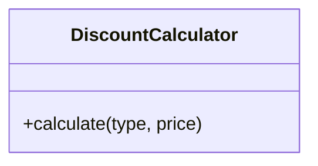
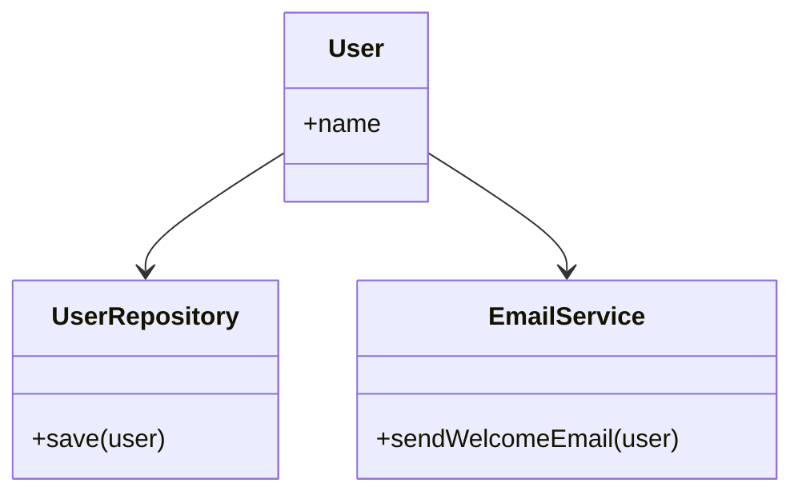
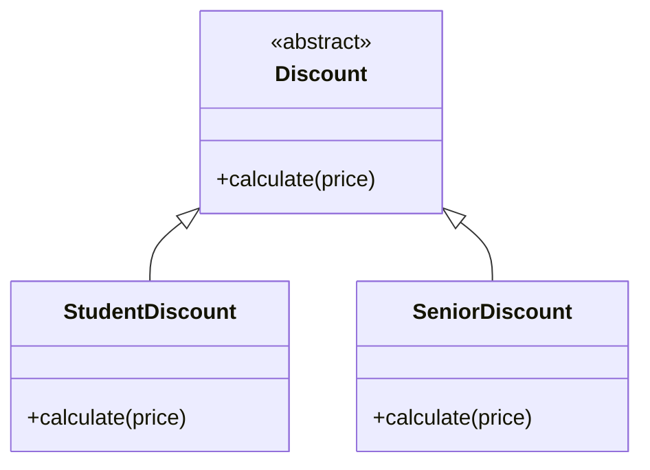
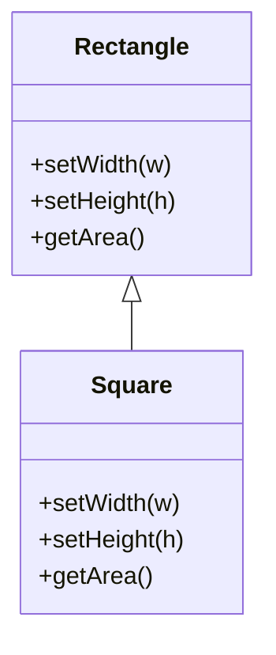
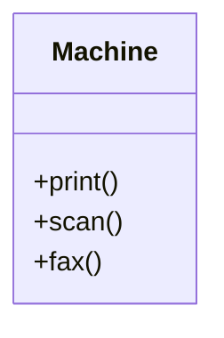
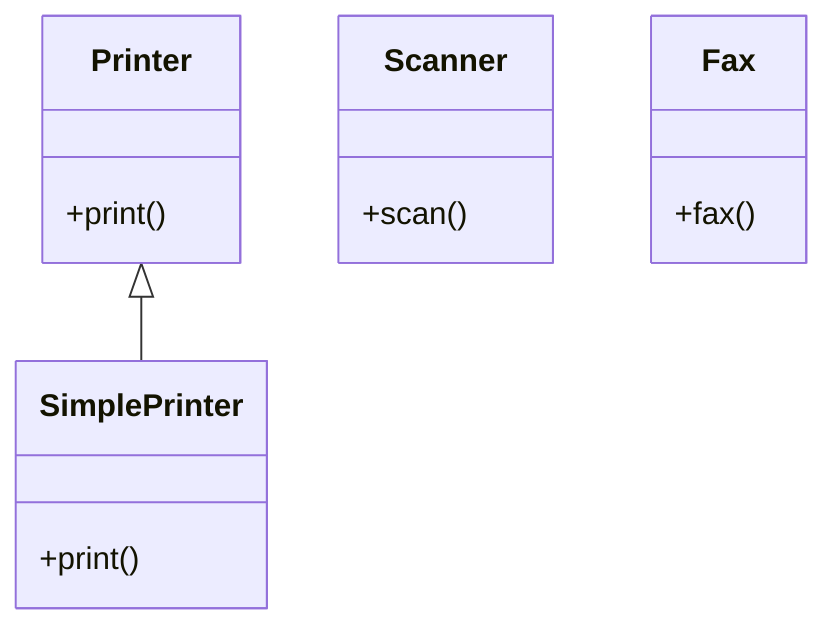
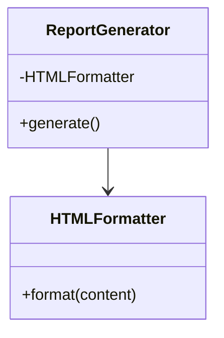
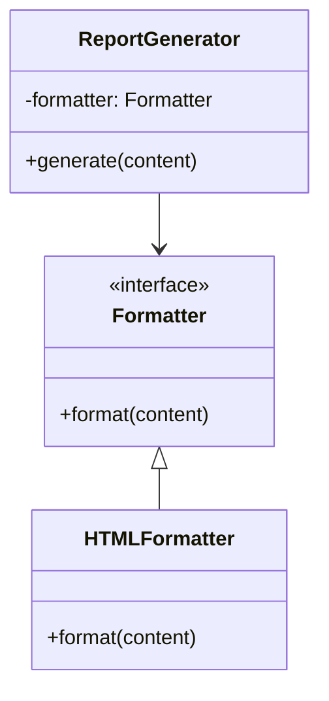

## 1. 単一責任の原則（Single Responsibility Principle）
「クラスは、1つのことだけを行うべきである」
- クラスやモジュールは、1つの責任（役割）だけを持つべきという考え方です。
- 例えば、データの保存と表示を同じクラスで行うと、どちらかの変更がもう一方に影響する可能性があります。
- 責任が1つであれば、変更の理由も1つになり、保守性が高まります。
- 悪い例


- 良い例



## 2. 開放閉鎖の原則（Open/Closed Principle）
「ソフトウェアの構成要素は、拡張に対して開かれており、修正に対して閉じられているべきである」
- 新しい機能を追加する際に、既存のコードを変更せずに拡張できるように設計するべきという考え方です。
- 例えば、抽象クラスやインターフェースを使って、既存の処理を変更せずに新しい振る舞いを追加できます。
- 悪い例


- 良い例



## 3. リスコフの置換原則（Liskov Substitution Principle）
「親クラスのオブジェクトを子クラスのオブジェクトで置き換えても、プログラムの動作が変わらないべきである」
- サブクラスは、親クラスの振る舞いを壊さずに拡張する必要があります。
- 例えば、親クラスが「四角形」で、子クラスが「正方形」の場合、正方形が四角形として扱われても問題が起きないように設計する必要があります。
- 悪い例



- 良い例

classDiagram
class Shape {
  <<abstract>>
  +getArea()
}

class Rectangle {
  +setWidth(w)
  +setHeight(h)
  +getArea()
}

class Square {
  +setSide(s)
  +getArea()
}

Shape <|-- Rectangle
Shape <|-- Square
```
## 4. インターフェース分離の原則（Interface Segregation Principle）
「クライアントは、使わないメソッドへの依存を強制されるべきではない」
- インターフェースは、必要な機能だけを提供するように分割すべきという考え方です。
- 例えば、1つの巨大なインターフェースに多くのメソッドがあると、使わないメソッドも実装しなければならなくなります。
- 小さく分割されたインターフェースを使うことで、柔軟で使いやすい設計になります。
- 悪い例



- 良い例




## 5. 依存性逆転の原則（Dependency Inversion Principle）
「高水準モジュールは、低水準モジュールに依存すべきではない。両者は抽象に依存すべきである」
- 実装ではなく、抽象（インターフェースや抽象クラス）に依存するように設計するべきという考え方です。
- 例えば、データベースの操作を直接クラスに書くのではなく、インターフェースを通じて操作することで、実装の変更に強くなります。
- 悪い例



- 良い例


