## f3
### 予想
A,B,Cの順番に出力される。

### 結果
例外をcatchできず、Error: Xが出力される。

### 説明文
then のコールバック内の例外は try/catch でキャッチできない。
そのためError: Xが出力され、try/catchのBとtry/finallyのCは出力されない。

## f4
### 予想
2秒後にAが出力され、1秒後にBと100が出力される。

### 結果
2秒後にAが出力され、1秒後にBと100が出力される。

### 説明文
wait2のPromiseで2秒待ち、その後1つ目のthenでAが即時に出力される。
return 40で40が次のthenに渡るが使用されず、wait(1000)で1秒待ち、return 100はラムダ式の戻り値としても扱われるので100が次のthenに渡る。
最後にlog(100)となり即時に100が出力される。

### 説明図

```mermaid
gantt
  title f4
  dateFormat  s
  axisFormat |
    wait2 :w2, 0, 2s
    logA  :lA, after w2, 0.1s
    wait1000 :w1, after lA, 1s
    logB  :lB, after w1, 0.1s
    log100  :l100, after lB, 0.1s
```

## f5
### 予想
2秒後にAとundefinedが出力される。2つめのthenの内容は無視される。

### 結果
1秒後にBが出力され、その1秒後にAと40が出力される。

### 説明文
wait2のPromiseで2秒待つので、実行開始から2秒後にAが出力される。
それと同時に、2つ目の then の引数が関数でなく Promise になっているので、中の実行に入り、すぐにwait1が実行されて1秒後にBが出力される。
一方で、2つ目の then の引数が関数でないので、無視されて、1つ目のthenの戻り値が3つ目のthenに渡り、Aの後に続けて40が出力される。

### 説明図

```mermaid
gantt
  title f5
  dateFormat  s
  axisFormat |
    wait2 :w2, 0, 2s
    logA  :lA, after w2, 0.1s
    log40  :l40, after lA, 0.1s
    wait1 :w1, after 0, 1s
    logB  :lB, after w1, 0.1s
```

## f6
### 予想
1つ目と2つ目のp.thenが同時に実行される。
1秒後にAが2つ、その1秒後にBが出力され、その1秒後にCが出力される。

### 結果
1秒後にAが出力され、その1秒後にBが出力され、その1秒後にCが出力される。

### 説明文
1つ目と2つ目のp.thenが同時に実行されるが、同じインスタンスのPromiseが複数同時に実行されるわけではない。
Promiseが解決したら、2つのPromiseチェーンが同時に実行され、wait1とwait2が同時に進むので、BとCが1秒ごとに実行される。

### 説明図

```mermaid
gantt
  title f6
  dateFormat  s
  axisFormat |
    wait1 :w11, 0, 1s
    logA  :lA, after w11, 0.1s
    wait1 :w12, after lA, 1s
    logB  :lB, after w12, 0.1s
    wait2 :w2, after lA, 2s
    logC  :lC, after w2, 0.1s
```

## f7
### 予想
1秒後にAが出力され、その1秒後に即時にBとCが出力される。

### 結果
1秒後にAが出力され、その1秒後に即時にBとCが出力される。

### 説明文
解決済みのPromiseのthenは即時に解決するPromiseとして扱われる。

### 説明図

```mermaid
gantt
  title f7
  dateFormat  s
  axisFormat |
    wait1 :w1, 0, 1s
    logA  :lA, after w1, 0.1s
    wait2 :w2, 0, 2s
    logB  :lB, after w2, 0.1s
    logC  :lC, after lB, 0.1s
```

## f8
### 予想
1秒後にXが出力され、同時にAが出力される。

### 結果
1秒後にXが出力され、同時にAが出力される。

### 説明文
1つ目のthenでエラーになるので、2つ目のthenは実行されずにcatchに進み、finallyに進む。

### 説明図

## f9
### 予想
1秒後にYが出力され、同時にAが出力される。

### 結果
1秒後にYが出力され、同時にAが出力される。

### 説明文
1つ目のthenは即時に解決し、2つ目のthenは実行されて例外が発生しcatchに進み、finallyに進む。

### 説明図

```mermaid
gantt
  title f9
  dateFormat  s
  axisFormat |
    wait1 :w1, 0, 1s
    () => 42  :42, after w1, 0.1s
    logY  :lX, after 42, 0.1s
    logA  :lA, after lX, 0.1s
```

## f10
### 予想
例外(Error : Y)が発生して終了する。

### 結果
1秒後にAが出力され、同時に例外(Error : Y)が発生して終了する。

### 説明文
then(r, c) のcは直前のエラーを処理するもののため、rで発生するエラーは処理しない。
finallyは必ず実行される必要があるため、Aが出力された後に例外が発生する。

### 説明図

```mermaid
gantt
  title f10
  dateFormat  s
  axisFormat |
    wait1 :w1, 0, 1s
    logA  :lA, after w1, 0.1s
    ErrorY  :eY, after lA, 0.1s
```

## f11
### 予想
new Promise 内の throw は .catch でキャッチできないため、エラーが発生して終わる。

### 結果
Xが出力される。

### 説明文
new Promise 内の throw は .catch でキャッチできる。

### 説明図
なし

## f12
### 予想
new Promise 内のコールバック関数で throw した場合は .catch でキャッチできないため、エラーが発生して終わる。

### 結果
予想通り。

### 説明文
new Promise 内のコールバック関数で throw した場合は .catch でキャッチできないため、エラーが発生して終わる。

### 説明図
なし

