## h1
### 予想
3秒後にAが出力され、2秒後にBが出力され、1秒後にCが出力される。

### 結果
3秒後にAが出力され、2秒後にBが出力され、1秒後にCが出力される。

### 説明文
async内でawaitで順番に待機しているため、3秒後にA、2秒後にB、1秒後にCが出力される。
例外は発生していないのでエラーメッセージは出力されない。

### 説明図

```mermaid
gantt
  title h1
  dateFormat  s
  axisFormat |
    wait3 :w3, 0, 3s
    logA  :lA, after w3, 0.1s
    wait2 :w2, after lA, 2s
    logB  :lB, after w2, 0.1s
    wait1 :w1, after lB, 1s
    logC  :lC, after w1, 0.1s
```

## h2
### 予想
エラーXが発生する

### 結果
Xが出力される

### 説明文
例外をcatchで捕捉しているため、エラーメッセージは出力されず、Xが出力される。

### 説明図
なし

## h3
### 予想
エラーXが発生する

### 結果
エラーXが発生する

### 説明文
new Promise の引数が async function の場合、例外はPromiseの外に伝播しないため、catchで捕捉されず、エラーメッセージが出力される。

### 説明図
なし

## h4
### 予想
エラーYが発生する

### 結果
エラーYが発生する

### 説明文
2つの例外は両方 catch できず、wait1でwait2より先に例外が発生したYの方だけエラーが発生する。

### 説明図
なし

