```mermaid
gantt
  title i4
  dateFormat  s
  axisFormat |
    v=0 : v0, 0, 0.1s
    wait1 :w1, after v0, 1s
    next=v+1  :v1, after w1, 0.1s
    wait2 :w2, after v1, 2s
    v=next  :n1, after w2, 0.1s
    next=v+1  :v2, after n1, 0.1s
    wait2 :w3, after v2, 2s
    v=next  :n2, after w3, 0.1s
    next=v+1  :v3, after n2, 0.1s
    wait2 :w4, after v3, 2s
    v=next  :n3, after w4, 0.1s
    next=v+1  :v4, after n3, 0.1s
    wait2 :w5, after v4, 2s
    v=next  :n4, after w5, 0.1s
    next=v+1  :v5, after n4, 0.1s
    wait2 :w6, after v5, 2s
    v=next  :n5, after w6, 0.1s
    
    next=v+1  :v21, after v0, 0.1s
    wait2 :w22, after v21, 2s
    v=next  :n21, after w22, 0.1s
    next=v+1  :v22, after n21, 0.1s
    wait2 :w23, after v22, 2s
    v=next  :n22, after w23, 0.1s
    next=v+1  :v23, after n22, 0.1s
    wait2 :w24, after v23, 2s
    v=next  :n23, after w24, 0.1s
    next=v+1  :v24, after n23, 0.1s
    wait2 :w25, after v24, 2s
    v=next  :n24, after w25, 0.1s
    next=v+1  :v25, after n24, 0.1s
    wait2 :w26, after v25, 2s
    v=next  :n25, after w26, 0.1s
```

## i1
### 予想
1秒後に42が出力され、その後2秒後に再度42が出力される。

### 結果
1秒後に42が出力され、その後2秒後に100が出力される。

### 説明文
Promise.anyは、最初に成功したPromiseの値を返すので、42が戻り値となりawaitが解除されlog(42)が実行される。
また他の処理もキャンセルされず、バックグラウンドで継続され、v=1000が設定され、wait2により2秒後にlog(100)が実行される。

### 説明図

```mermaid
gantt
  title i1
  dateFormat  s
  axisFormat |
    wait1 :w1, 0, 1s
    log42  :l42, after w1, 0.1s
    wait2 :w2, 0, 2s
    wait2 :w22, after l42, 2s
    log100  :l100, after w22, 0.1s
```

## i2
### 予想
1秒おきにC,B,Aが出力され、最後に配列["C","B","A"]が出力される。

### 結果
1秒おきにC,B,Aが出力され、最後に配列["A","B","C"]が出力される。

### 説明文
Promise.allは、全てのPromiseが成功した場合に、その結果を配列で返す。
1秒おきにC,B,Aが出力され、最後に配列["A","B","C"]が出力される。
Promise.all() に渡した配列の順になる仕様のため、["A","B","C"]となる。

### 説明図

```mermaid
gantt
  title 32
  dateFormat  s
  axisFormat |
    wait3 :w3, 0, 3s
    logA  :lA, after w3, 0.1s
    wait2 :w2, 0, 2s
    logB  :lB, after w2, 0.1s
    wait1 :w1, 0, 1s
    logC  :lC, after w1, 0.1s
    log[A,B,C]  :lABC, after lA, 0.1s
```

## i3
### 予想
1秒後にYと42が出力されて、その後3秒後に42が出力される。

### 結果
1秒後にYと42が出力されて、その後1秒後Bが出力され、2秒後に0が出力される。

### 説明文
1秒後に例外が発生しcatchされlogYが実行される。
その後log(v)ではそのまま42が出力される。
例外が発生しても他の処理はキャンセルされず、バックグラウンドで継続され、
wait2により1秒後にBが出力され、さらに1秒後にv=0が適用されlog(0)が実行される。

### 説明図

```mermaid
gantt
  title i3
  dateFormat  s
  axisFormat |
    v=42 :v42, 0, 0.1s
    wait3 :w3, after v42, 3s
    v=0  :v0, after w3, 0.1s
    wait2 :w2, after v42, 2s
    logB  :lB, after w2, 0.1s
    wait1 :w1, after v42, 1s
    errY  :eY, after w1, 0.1s
    logY  :lY, after eY, 0.1s
    log42  :l42, after lY, 0.1s
    wait3 :w32, after l42, 3s
    log0  :l0, after w32, 0.1s
```

## i4
### 予想
11秒後に5が出力される。

### 結果
11秒後に5が出力される。

### 説明文
読み込みと書き込みの間に await が入ると、p2での処理がp1での処理で上書きされてしまうため、最終的に5が出力される。
修正方法としては、nextも共通の変数に修正して、さらにp1の方はnext = v + 1;の前にv = next;を追加してp2側でインクリメントしたnextを引き継げるようにする。

### 説明図

