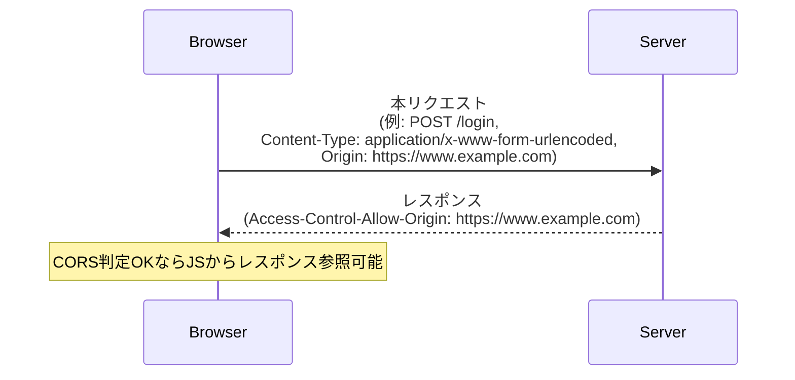
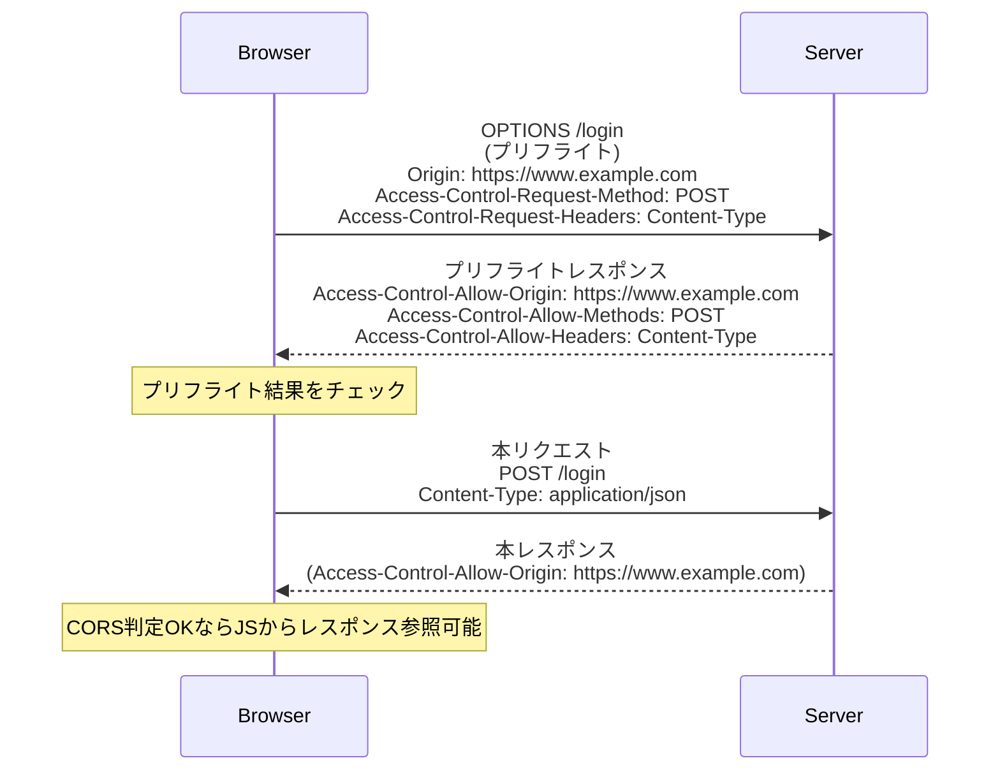
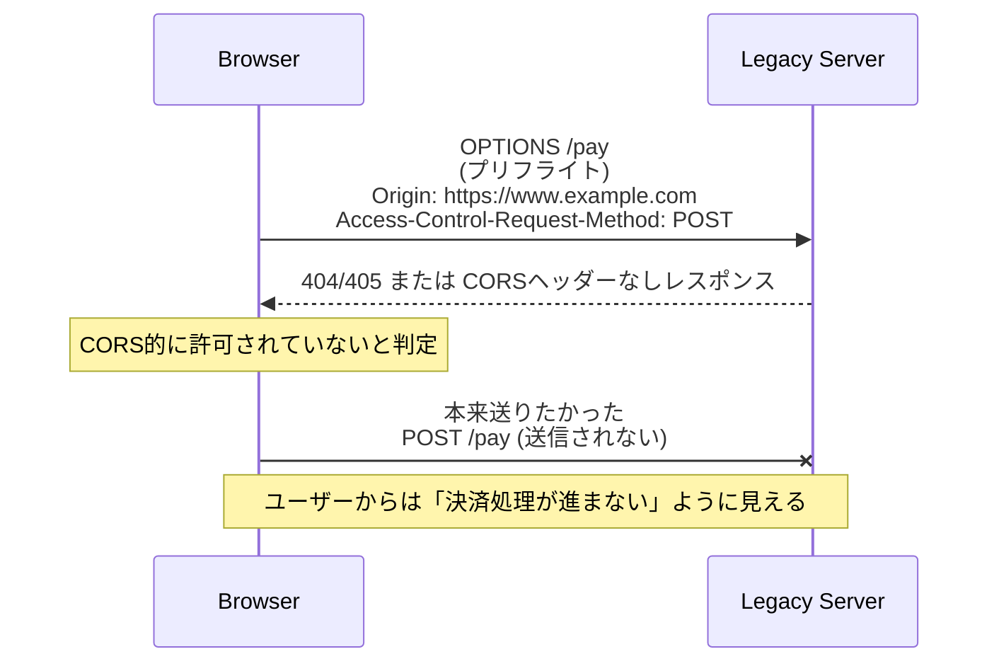

### CORS Cross-Origin Resource Sharing（オリジン間リソース共有）とは
- ブラウザが、異なるオリジンにあるリソースへアクセスするときに、それを許可するかどうかをHTTPヘッダーで制御する仕組み
- ブラウザには「同一オリジンポリシー（SOP）」があり、プロトコル・ドメイン・ポートの組み合わせが違うオリジンへのJSからのアクセスを原則禁止する
- CORSは、この制限を「全部解除」ではなく、「サーバーが許可した範囲だけ例外的にOKにする」ための仕組みとなっている
- ブラウザはリクエスト時にOriginヘッダー（例: https://example.com）を付けてサーバーに送り、サーバーが Access-Control-Allow-Origin: https://example.com のようなヘッダーをレスポンスに付けると、そのオリジンからのアクセスだけを許可したことになる
- 安全でないメソッドやカスタムヘッダーを使う場合、ブラウザは事前に OPTIONS で「プリフライトリクエスト」を送り、サーバーが本当に許可しているか確認する
- 参考サイト：https://tech-lab.sios.jp/archives/37299
- 参考サイト：https://developers.play.jp/entry/2024/05/31/174429

## CORSがなかった場合に起こる問題点
### 漏洩・改ざん1
- 悪意のあるサイトが、ユーザーがログインしている他のサイトに対して不正なリクエストを送信できてしまう
- 例えば、ユーザーが銀行のウェブサイトにログインしている状態で、悪意のあるサイトがその銀行に対して送金リクエストを送信することが可能になる
- これにより、ユーザーの資金が不正に引き出されるリスクがある
- 参考サイト：https://pochanglab.com/blog/cors

### 漏洩・改ざん2
- 悪意のあるサイトが、ユーザーがログインしている他のサイトに対して不正なリクエストを送信し、そのレスポンスを取得できてしまう
- 例えば、ユーザーがSNSにログインしている状態で、悪意のあるサイトがそのSNSに対して投稿リクエストを送信し、そのレスポンスを取得することが可能になる
- これにより、ユーザーのアカウントが不正に操作されるリスクがある
- 参考サイト：https://pochanglab.com/blog/cors

### Preflight リクエストとは
- プリフライトリクエストは、CORSにおいて、ブラウザが実際のリクエストを送信する前にサーバーに対して行う事前確認のためのHTTP OPTIONSリクエスト
- ブラウザは、実際のリクエストが安全であるかどうかを確認するために、プリフライトリクエストを送信し、サーバーがそのリクエストを許可するかどうかを判断する(B)

- CORS登場前から動いていたサーバは、そもそも「OPTIONSにCORSヘッダーで答える」ということができない(A)
- レガシーサーバに対して、ブラウザ側の仕様だけを変えて、プリフライトを送るようにすると、次のようなことが起こる
    - ブラウザがまずOPTIONS（プリフライト）を送る
    - レガシーサーバはOPTIONSを想定しておらず、404/405 を返す
    - 仮に200を返せたとしてもAccess-Control-Allow-OriginなどCORSヘッダーを返さない
- ブラウザは「CORS的に許可されていない」と判断し、本来のメインリクエスト（決済、注文、ログインなど）を送らない
- 結果として、ユーザーから見ると「ボタンを押しても処理が進まない」という状態になる(C)
- 参考サイト：https://zenn.dev/tm35/articles/ad05d8605588bd

### 単純リクエスト（プリフライトなし）…(A)

### プリフライトありのリクエスト…(B)

### レガシーサーバーに対するCORSエラー発生時シーケンス…(C)

