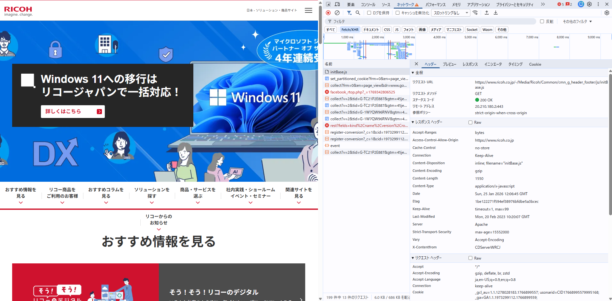
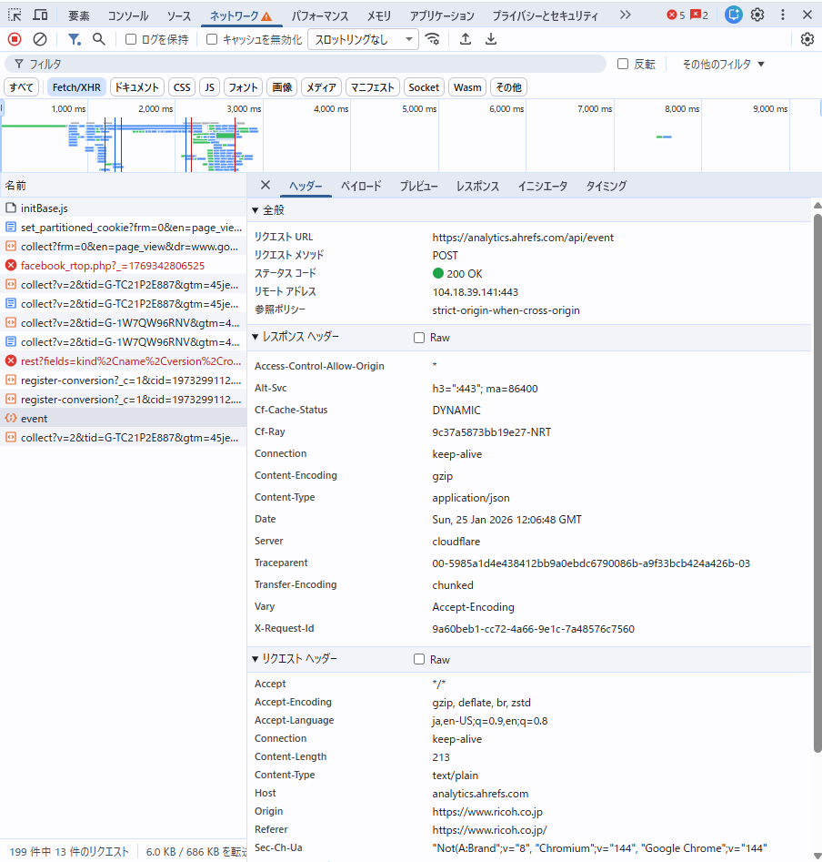

### リコーの公式サイト（https://www.ricoh.co.jp/）を開いた結果

### リクエストURL:https://www.ricoh.co.jp/-/Media/Ricoh/Common/cmn_g_header_footer/js/initBase.js
- Access-Control-Allow-Origin: https://www.ricoh.co.jp
- これはリコーのサイトが、initBase.jsファイルに対して、同一オリジンポリシーを適用していることを示している

### リクエストURL:https://analytics.ahrefs.com/api/event
- Access-Control-Allow-Origin: *
- これは、Ahrefsという分析サービスが、任意のドメインからのリクエストを許可していることを示している
- これにより多くのウェブサイトがこの分析サービスを利用できるようになり、分析のためのデータ収集が容易になる
